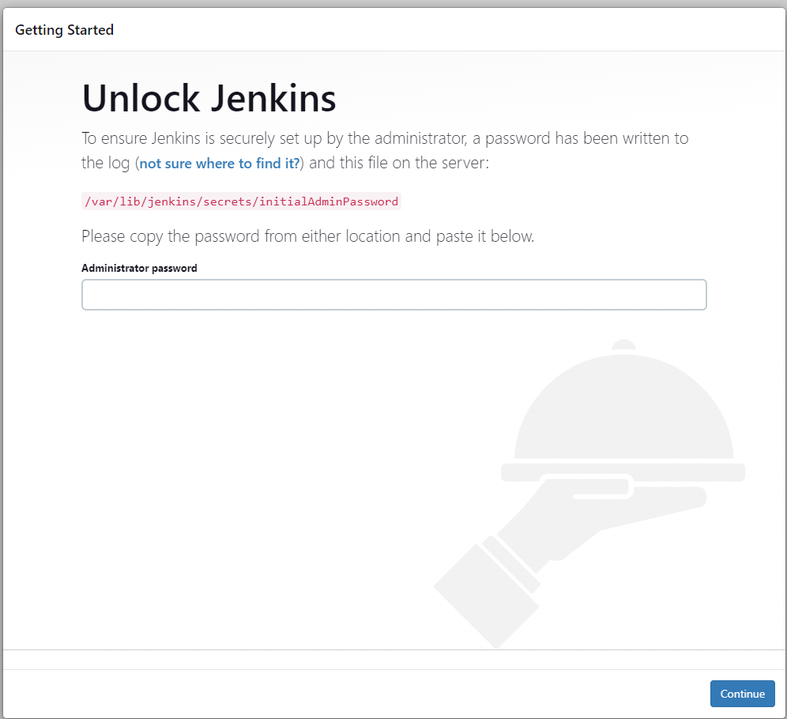
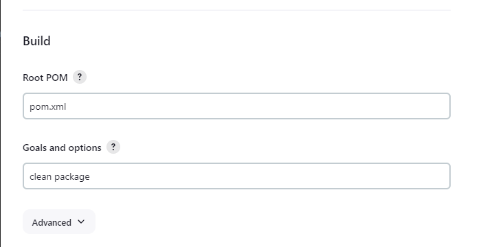
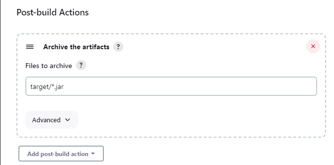

# CodeHub Project on Cyber Security and DevOps 2023
  
## To Access the VM running jenkins : 
- 20.16.237.37:8080
- Username : Admin
- Password : DevOps2023!

## Step 1:

### Using the infrastructure as code model we used terraform to define the resources we needed for our project which were:
- Resource Group
- Virtual Network
- Subnet
- Network interface 
- Virtual machine
- Scurity Group (to control the traffic of our VM)
- Public IP (to be able to access our VM)
  
The commands used where :
- terraform init
- terraform plan 
- terraform apply -auto-approve

We then accessed our VM through SSH using the public ip we created before and installed java. Then we added the jenkins repository and finally we installed jenkins.

You can use the official documentation here for any help: https://www.jenkins.io/doc/book/installing/linux/

*Disclamer: We had some problems while trying to insall java 11 so here is a solution which helped us : https://askubuntu.com/questions/1203898/package-openjdk-11-jdk-has-no-installation-candidate*

We found the password for the initial connection thought the path provided : 

## Step 2 :

Forked the given repository : 

## Step 3 : 

For this step we first installed the maven plugin on our VM. We then created a maven project and in the source code management section we added the forked repository.

Then with the help of the plugin very easily we configurated the project to make a jar file. 

And finally we archive the jar created :

## Step 4 : 

We created a pipeline (Step-4) which clones the code from the git repository. Creates a jar file using maven. 
Builds a docker image with said jar file. And finally it publishes the image to my dockerhub account.  
In order for our jenkins to have access to my dockerhub account and for security purposes we created an access token so we could give the vm specific priviledges.

### Here is the Stage View of the pipeline:

## Step 5 : 

For step 5 we created a new repository where we hosted the terraform code (https://github.com/IASON-ZG/VM-Deployment) and then we created a pipeline that has 4 stages (Step-5 is the name of the script)
- Build (Cloning the terraform code from the repository)
- Loging in to Azure (We achieved this securely throught service principals more info later)
- Terraform init (initializing terraform)
- Terraform apply (applying the terraform code and creating the resources specified) 

The result of the pipeline is the creation of these resources : 
- Public IP
- Network Interface
- Virtual Machine

Lastly we configurated a webhook so whenever the Terraform code was updated the pipeline was built again.

In order for our VM to have access to azure securely we created a service principal. A role per say in our resource group with limited permissions.

## Step 6 : 
 
Firstly we had to install Ansible on our Master Node. Then we wrote an ansible playbook that does the following : 
- Installs Docker
- Installs Python
- Installs the required system packages

And then :
- Downloads the latest image of our toDoAppWithLogin from dockerhub.
- Checks if a container is already up and running with the outdated image.
- If another container is active it shuts it down, removes it from the docker files and initializes a new container with the latest image.  

We had to configurate the container to connect with remote database server on azure(Check file : Step-6-playbook)

And the result : 

And the app is up and running (http://team1app.westeurope.cloudapp.azure.com:8080/): 

### *Disclaimer: Because we have created a database resource on azure there is no need for a mySQL container* 

## Step 7 : 

For this step we had to add 2 things. Firstly a webhook on pipeline Step-4 so whenever the java files changed then a new docker image would be created and published. And secondly we added a new stage in the script of pipeline Step-4 so whenever the new image is published pipeline Step-6 will start building so it would build a new container with the updated app image.

The webhook works : 

The added stage : 

